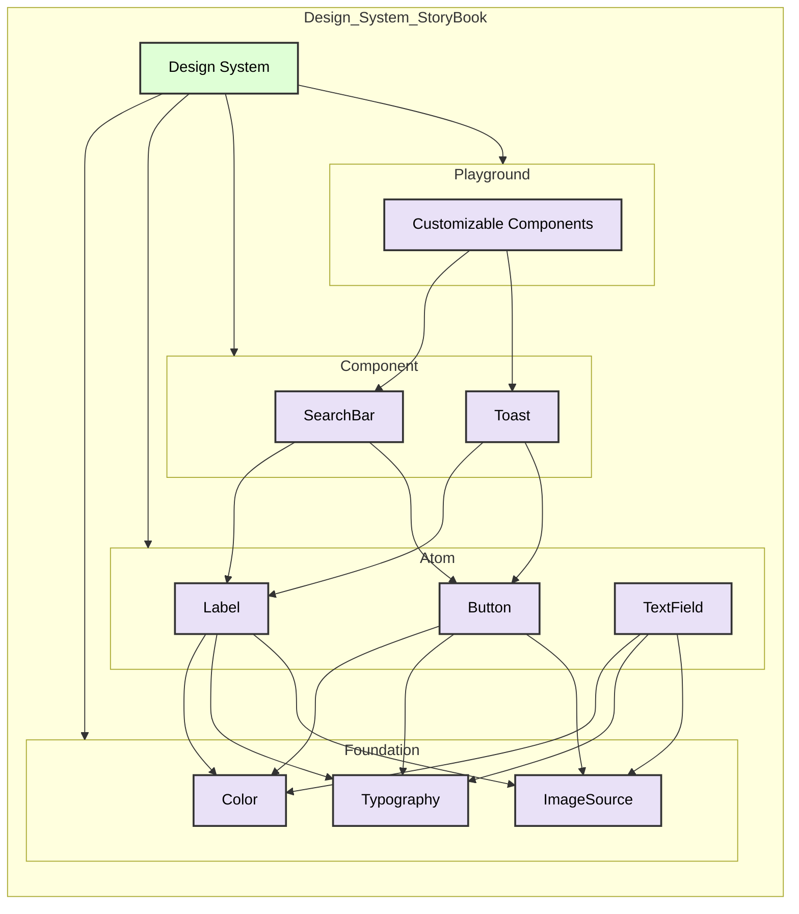

# Design System StoryBook

화면을 이루는 각각의 컴포넌트들에 대해 정의하고, 한눈에 찾아보기 쉽게 정리해놓은 메뉴리스트 형식의 앱 입니다.
각각의 컴포넌트에 사용되는 기본적인 구성 요소( Color, Typography, Image .. ) 들을 Sementic 하게 정의하고 사용하여 개발자-디자이너와의 소통 오류를 줄이고자 설계되었습니다.

아래 문서에서는 

- Design System을 구성하는 컴포넌트들의  StoryBook을 만드는 목적
- 설계
- 핵심 구성 요소 `Foundation`, `Atom`, `Component`, `Playground`

에 대해 간략히 설명합니다. 

---

## 목차

1. [Design System의 필요성](#design-system의-필요성)
   - [디자인 파트와의 유연한 소통](#디자인-파트와의-유연한-소통)
   - [Developer Experience 향상](#developer-experience-향상)
   - [Server-Driven-UI 구현](#server-driven-ui-구현)
2. [Design System 설계](#design-system-설계)
   - [설계 방식](#설계-방식)
   - [설계 구성](#설계-구성)
   - [Design Part](#design-part)
   - [Develop Part](#develop-part)
3. [Foundation](#foundation)
   - [Color](#color)
   - [Typography](#typography)
   - [ImageSource](#imagesource)
4. [Atom](#atom)
   - [Label](#label)
   - [Button](#button)
   - [TextField](#textfield)
5. [Component](#component)
   - [SearchBar](#searchbar)
   - [Toast](#toast)
6. [Playground](#playground)
   - [현재 구현된 Component](#현재-구현된-component)

---

## Design System 의 필요성

### 1. 디자인 파트와의 유연한 소통

- 소통 오류로 인한 리소스 낭비 최소화

### 2. Developer Experience 향상

- 개발자들의 작업 효율성 증대

### 3. Server-Driven-UI 구현

- 다양한 컴포넌트들과의 조합을  통해 하나의 화면을 구성할 수 있도록 하기 위함
- 최종적으로 Server-Driven-UI 구현을 목표로 합니다.

---

## Design System 설계

### 설계 방식
- Design Token의 개념을 가져와 디자이너 관점에서의 디자인 시스템을 설계할 때와 유사한 구조로 설계를 시도합니다.
- **Reference Token**
    - Global Token으로 표현할 수 있으며 인터페이스에서 사용된 모든 `Color`, `Typography`, `Spacing` 등과 같은 기본이 되는 값을 정의하여 Reference Token으로 정의합니다.
- **System Token**
    - 정의한 Reference Token을 시스템 내에서 사용하는 테마나 컨텍스트에 맞는 토큰 이름으로 지정하며 Reference Token을 System Token으로 재정의하여 의도된 목적에 맞게 사용될 수 있도록 참조시켜줍니다. 모든 System Token은 Reference Token에서 가져옵니다.
- **Component Token**
    - System Token에서 정의한 값 또는 Reference Token을 참조하며 Component에 해당하는 값으로 정의한 요소를 나타냅니다.

### 설계 구성

Design 파트의 Token 개념을 기반으로 Develop 파트에서 대칭되어 사용될 개념을 정의합니다.

- Reference Token ←→ Foundation
- System Token ←→ Atom
- Component Token ←→ Component

### Design Part

- Reference Token
- System Token
- Component Token

### Develop Part

- Foundation
- Atom
- Component

---

## Foundation

모든 디자인 컴포넌트를 구성하는 가장 기본적인 요소를 Foundation으로 정의합니다. 실제로 컴포넌트 바깥에서 사용하지 않는 것을 지양합니다.

### Color

- 단순 컬러값입니다. 일반적으로 사용하는 Color palette 에 정의된 컬러값을 의미합니다. ( gray100, gray200 … )

### Typography

- 단순 Font Size를 직접 설정하여 사용하기보단, Typography를 용도에 따라 구분하고 직관적인 이름을 사용해 사용 목적을 쉽게 이해할 수 있도록 구분

### ImageSource

- UIImage 또는 AnimationImage

---

## Atom

UIButton, UILabel 등의 컴포넌트를 이루는 UI 요소를 Atom으로 정의합니다. Color, Typography, ImageSource의 조합으로 구성됩니다.

### Atom 구성 예시

- **Label**: 텍스트 표시를 위한 기본 요소
    - 실행 영상
    
    https://github.com/user-attachments/assets/cf7b6af7-7c99-43cc-9965-3d13b23f7f35

- **Button**: 사용자 상호작용을 위한 클릭 가능한 요소
    - 실행 영상

    https://github.com/user-attachments/assets/7326f2fb-0a36-4f43-ba3c-cb441ed8a3d1

- **TextField**: 사용자 입력을 받기 위한 텍스트 입력 필드
    - 실행 영상

    https://github.com/user-attachments/assets/bbf9c2d5-2d3c-451e-a523-abc94a4552d2
  
---

## Component

Atom 조합의 구성을 Component로 정의합니다. 실제 화면을 구성하기 위해 사용되는 최소 단위입니다. Component 내부에서만 Foundation, Atom을 직접적으로 사용합니다.

### Component 구성 예시

- **SearchBar**: 사용자가 검색어를 입력할 수 있는 검색 인터페이스
    - 실행 영상
        
  https://github.com/user-attachments/assets/c2de3897-2043-4eca-9854-5f66fadd5b0a
      
- **Toast**: 사용자에게 일시적으로 메시지를 보여주는 알림 요소
    - 실행 영상
        
    https://github.com/user-attachments/assets/939a9dbf-fe44-41bd-914a-a80cf64e3b5c

---

## Playground

SearchBar, Toast 혹은 Label/Button/TextField를 조합한 Component들을 사용하여 원하는 화면을 커스터마이징 할 수 있도록 만든 Playground입니다.

- 현재 구현된 **`SerachBar`**, **`Button`**, **`Label`**, **`TextField`** 를 버튼을 통해 간단히 추가 및 삭제할 수 있도록 구현되어 있습니다.
- 최종적으로는 서버로부터 받은 JSON String을 통해 컴포넌트 Model을 Parsing, 생성된 컴포넌트 모델들을 기반으로 화면을 구성할 수 있는 것을 목표로 합니다. (작업 예정)
    
https://github.com/user-attachments/assets/c8379fff-b8e8-45fe-b0aa-5db85d5b5dc5

### 현재 구현된 Component

- SearchBar
- Toast
- Label
- Button
- TextField
